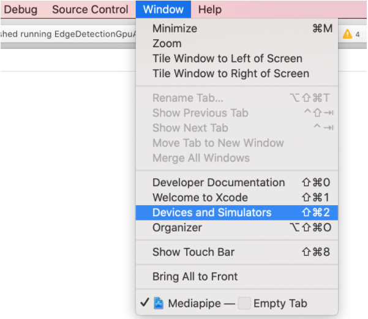
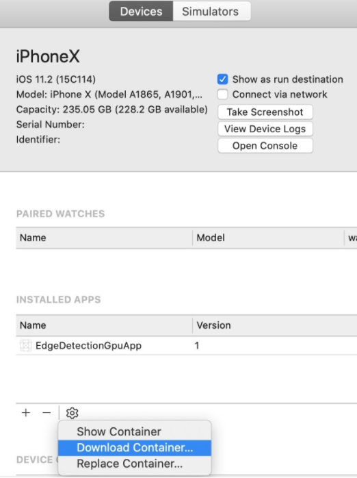
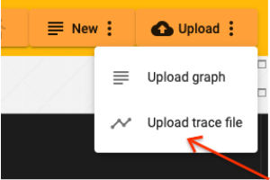
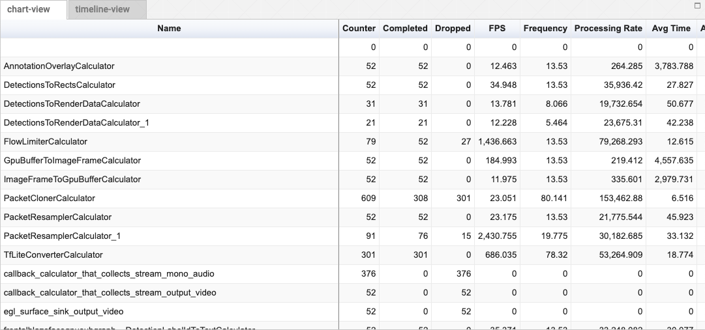

# Tracing and Profiling
{: .no_toc }

1. TOC
{:toc}
---

The MediaPipe framework includes a built-in tracer and profiler. The tracer
records various timing events related to packet processing, including the start
and end time of each Calculator::Process call. The tracer writes trace log files
in binary protobuf format. The profiler further accumulates for each running
calculator a histogram of latencies for Process calls. Tracing and profiling is
available on Linux, Android, or iOS.

## Enabling tracing and profiling

To enable tracing and profiling of a mediapipe graph:

   1. The profiling library must be linked to the framework.
   2. Tracing and profiling must be enabled in the graph configuration.

The profiling library is linked to the framework by default for Desktop.
If needed, it can be omitted from the framework using the bazel command line
option: `--define MEDIAPIPE_PROFILING=0`.  For other platforms, you can use the
bazel command line option `--define MEDIAPIPE_PROFILING=1` to link it.

To enable tracing and profiling, the `CalculatorGraphConfig` (in
[calculator.proto](https://github.com/google/mediapipe/tree/master/mediapipe/framework/calculator.proto))
representing the graph must have a `profiler_config` message at its root. Here
is a simple setup that turns on tracing and keeps 100 seconds of timing events:

```
profiler_config {
  trace_enabled: true
  enable_profiler: true
  trace_log_interval_count: 200
  trace_log_path: "/sdcard/Download/"
}
```

*   `enable_profiler` is required to emit any logging at all.

*   `trace_enabled` gives us packet level information needed for offline
    profiling.

*   `trace_log_count` is a convenience that allows us to, by default, to chop up
    our log into five separate files which are filled up in a round robin
    fashion (after the fifth file is recorded, the first file is used again).
    The trace log files are named `trace_0.log` through `trace_k.log`.

    See [Profiler configuration](#profiler_configuration) for other settings
    available in the profiler config. Note that most of the other settings are
    considered advanced, and in general should not be needed.

## Collecting the Logs

MediaPipe will emit data into a pre-specified directory:

*   On the desktop, this will be the `/tmp` directory.

*   On Android, this will be the external storage directory (e.g., `/storage/emulated/0/`).

*   On iOS, this can be reached through XCode. Select "Window/Devices and
    Simulators" and select the "Devices" tab.

    

    You can open the Download Container. Logs will be located in `application
    container/.xcappdata/AppData/Documents/`
    If XCode shows empty content for the downloaded container file, you can
    right click and select 'Show Package Contents' in Finder. Logs
    will be located in 'AppData/Documents/'

    

Log files are written to `\<trace_log_path index\>.binarypb` where, by default,
`\<trace_log_path\>` is equal to `mediapipe_trace_` (the entire path and file
prefix can be overwritten by setting `trace_log_path` within the
`profiler_config` message). The index will, by default, alternate between 0 and
1, unless you've overridden the trace_log_count as we did, above.

By default, each file records five seconds of events. (Advanced: Specifically,
we record ten intervals of half a second each. This can be overridden by adding
`trace_log_interval_usec` and `trace_log_interval_count` to `profiler_config`).

### Tracing on Linux

1.  Follow the instructions stated above in `Enable tracing`

2.  Build and run your MediaPipe graph. The running graph writes trace events as
    stated above in `Collect the logs`

### Tracing on Android

*   Ensure that the Android app has write permissions to external storage.

    *   Include the line below in your `AndroidManifest.xml` file.

        ```xml
        <uses-permission android:name="android.permission.MANAGE_EXTERNAL_STORAGE" />
        ```

    *   Grant the permission either upon first app launch, or by going into
        `Settings -> Apps & notifications -> $YOUR_APP -> Permissions` and
        enable `Storage`.

*   Add the following protobuf message into the existing calculator-graph-config
    protobuf, such as the existing `.pbtxt` file. Follow the instructions stated
    above in `Enable tracing`

*   Connect your Android device and run `adb devices`.

    ```bash
      adb devices
      # should print:
      # List of devices attached
      # 805KPWQ1876505    device
    ```

*   Use `bazel build` to compile the Android app and use `adb install` to get it
    installed on your Android device.

*   Open the installed Android app. The running MediaPipe graph appends trace
    events to a trace log files at:

    ```bash
    /storage/emulated/0/Download/mediapipe_trace_0.binarypb
    /storage/emulated/0/Download/mediapipe_trace_1.binarypb
    ```

    After every 5 sec, writing shifts to a successive trace log file, such that
    the most recent 5 sec of events are preserved. You can check whether the
    trace files have been written to the device using adb shell.

    ```bash
    adb shell "ls -la /storage/emulated/0/Download"
    ```

    On android, MediaPipe selects the external storage (e.g., `/storage/emulated/0/`) for
    trace logs. This directory can be overridden using the setting
    `trace_log_path`, like:

    ```bash
    profiler_config {
      trace_enabled: true
      enable_profiler: true
      trace_log_path: "/sdcard/Download/profiles/"
    }
    ```

    Note: The forward slash at the end of the `trace_log_path` is necessary for
    indicating that `profiles` is a directory (that *should* exist).

*   Download the trace files from the device.

    ```bash
    # from your terminal
    adb pull /storage/emulated/0/Download/mediapipe_trace_0.binarypb
    # if successful you should see something like
    # /sdcard/mediapipe_trace_0.binarypb: 1 file pulled. 0.1 MB/s (6766 bytes in 0.045s)
    ```

## Analyzing the Logs

Trace logs can be analyzed from within the visualizer.

1.  Navigate to
    [viz.mediapipe.dev](https://viz.mediapipe.dev)

2.  Click on the "Upload" button in the upper right.

    

3.  Click on "Upload trace file".

    

    A sample trace file has been generated for you:
    [sample_trace_binary.pb](../data/visualizer/sample_trace.binarypb)

4.  A file selection popup will appear. Select the `.binarypb` that holds your
    trace information.

5.  A chart view will appear. All of your calculators will appear along the left
    with profiling information listed along the top.

    

    Click on a header to alternately sort that column in ascending or descending
    order. You can also scroll horizontally and vertically within the control to
    see more columns and more calculators.

### Explanation of columns:

name
:   The name of the calculator.

fps
:   The number of frames that this calculator can generate each second, on
    average. `1 / (input_latency_mean + time_mean`) (Units are 1 / second).

frequency
:   The rate that this calculator was asked to process packets per second.
    (Computed by `# of calls total / (last_call_time - first_call_time))`.
    (Units are `1 / second`)

counter
:   Number of times process() was called on the calculator. It is the `sum of
    dropped + completed`.

dropped
:   Number of times the calculator was called but did not produce an output.

completed
:   Number of times that this calculator was asked to process inputs after which
    it generated outputs.

processing_rate
:   `1E+6 / time_mean`. The number of times per second this calculator could run
    process, on average. (Units are `1 / second`).

thread_count
:   The number of threads that made use of each calculator.

time_mean
:   Average time spent within a calculator (in microseconds).

time_stddev
:   Standard deviation of time_mean (in microseconds).

time_total
:   Total time spent within a calculator (in microseconds).

time_percent
:   Percent of total time spent within a calculator.

input_latency_mean
:   Average latency between earliest input packet used by a iteration of the
    calculator and when the calculator actually begins processing (in
    microseconds).

input_latency_stddev
:   Standard deviation of input_latency_mean (in microseconds).

input_latency_total
:   Total accumulated input_latency (in microseconds).

## Profiler configuration

Many of the following settings are advanced and not recommended for general
usage. Consult [Enabling tracing and profiling](#enabling-tracing-and-profiling)
for a friendlier introduction.

histogram_interval_size_usec :Specifies the size of the runtimes histogram
intervals (in microseconds) to generate the histogram of the Process() time. The
last interval extends to +inf. If not specified, the interval is 1000000 usec =
1 sec.

num_histogram_intervals :Specifies the number of intervals to generate the
histogram of the `Process()` runtime. If not specified, one interval is used.

enable_profiler
:   If true, the profiler starts profiling when graph is initialized.

enable_stream_latency
:   If true, the profiler also profiles the stream latency and input-output
    latency. No-op if enable_profiler is false.

use_packet_timestamp_for_added_packet
:   If true, the profiler uses packet timestamp (as production time and source
    production time) for packets added by calling
    `CalculatorGraph::AddPacketToInputStream()`. If false, uses the profiler's
    clock.

trace_log_capacity
:   The maximum number of trace events buffered in memory. The default value
    buffers up to 20000 events.

trace_event_types_disabled
:   Trace event types that are not logged.

trace_log_path
:   The output directory and base-name prefix for trace log files. Log files are
    written to: StrCat(trace_log_path, index, "`.binarypb`")

trace_log_count
:   The number of trace log files retained. The trace log files are named
    "`trace_0.log`" through "`trace_k.log`". The default value specifies 2
    output files retained.

trace_log_interval_usec
:   The interval in microseconds between trace log output. The default value
    specifies trace log output once every 0.5 sec.

trace_log_margin_usec
:   The interval in microseconds between TimeNow and the highest times included
    in trace log output. This margin allows time for events to be appended to
    the TraceBuffer.

trace_log_instant_events
:   False specifies an event for each calculator invocation. True specifies a
    separate event for each start and finish time.

trace_log_interval_count
:   The number of trace log intervals per file. The total log duration is:
    `trace_log_interval_usec * trace_log_file_count * trace_log_interval_count`.
    The default value specifies 10 intervals per file.

trace_log_disabled
:   An option to turn ON/OFF writing trace files to disk. Saving trace files to
    disk is enabled by default.

trace_enabled
:   If true, tracer timing events are recorded and reported.
